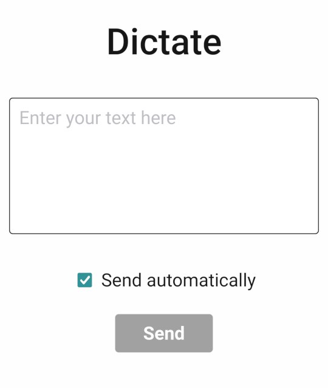

# dictate

[](https://github.com/prettier/prettier)
[](https://github.com/psf/black)

Server and client to send text from a device and paste it in another. Intended to be used with [Whisper for Android](https://f-droid.org/es/packages/org.woheller69.whisper)

Made with [Toga](https://github.com/beeware/toga) and [Briefcase](https://github.com/beeware/briefcase)




# Build on Linux

1. Clone this repo:
```
git clone https://github.com/antruc/dictate.git
cd dictate
```
2. Set up a virtual environment:
```
python3 -m venv env
source env/bin/activate
```
3. Install dependencies:
```
pip install -r requirements.txt
```
4. Generate a self-signed SSL certificate:
```
openssl req -x509 -newkey rsa:4096 -keyout server/dictate/key.pem -out server/dictate/cert.pem -sha256 -days 365 -nodes
```
5. Build:
```
briefcase create
briefcase build
```
6. Start the program:
```
./dictate
```
Finally, in another device, scan the QR code to access the client interface
